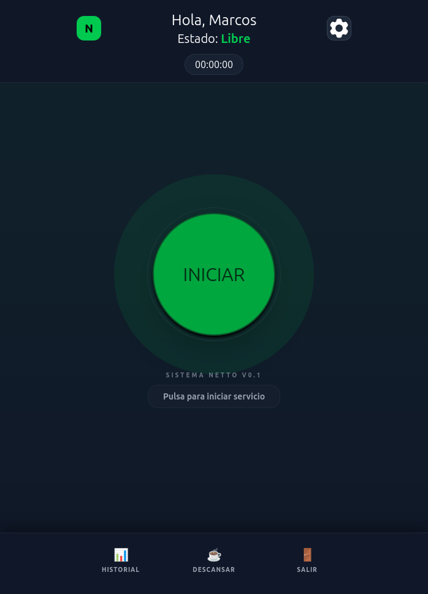
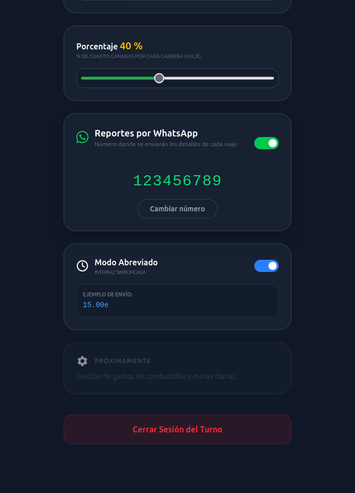
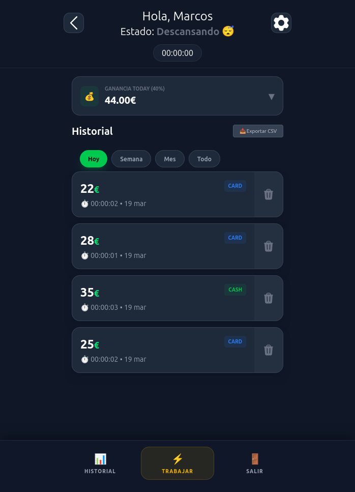

# Netto

Aplicación web para taxistas que permite registrar viajes, consultar la recaudación y calcular la liquidación entre conductor y empresa.

[Ver aplicación](https://netto-zeta.vercel.app/) · [Repositorio](https://github.com/neo091/netto)

## Qué problema resuelve

Cuando un conductor trabaja a comisión, los cobros en efectivo y con tarjeta tienen efectos diferentes sobre la liquidación:

- El efectivo queda en manos del conductor.
- Los cobros con tarjeta los recibe la empresa.
- El conductor obtiene el porcentaje acordado sobre la recaudación.

Netto calcula el balance entre la comisión del conductor y el efectivo que ha recibido.

Por ejemplo, con una comisión del 40 %:

| Viaje | Comisión del conductor | Liquidación |
|---|---:|---|
| 100 € cobrados con tarjeta | 40 € | La empresa debe entregar 40 € al conductor |
| 100 € cobrados en efectivo | 40 € | El conductor debe entregar 60 € a la empresa |

Un balance positivo indica dinero a cobrar; uno negativo, dinero a entregar.

## Funcionalidades

- Gestión del estado del conductor: libre, ocupado, pagando y descanso.
- Registro de viajes y método de pago.
- Porcentaje de comisión configurable, con un 40 % inicial.
- Historial de viajes con filtros por fechas y paginación.
- Resumen de recaudación, comisión y liquidación.
- Gráficas de actividad.
- Inicio de sesión y recuperación de contraseña mediante Supabase.
- Envío de sugerencias para usuarios autenticados.
- Solicitud pública de acceso con protección mediante Turnstile.
- Interfaz adaptable a móvil con tema oscuro.

El acceso está en fase beta y se solicita desde el formulario de invitación.

## Capturas

<p align="center">
  
  
  
</p>

## Tecnologías

| Área | Tecnología |
|---|---|
| Interfaz | React 19, JavaScript y TypeScript |
| Desarrollo y compilación | Vite |
| Estilos | Tailwind CSS |
| Navegación | React Router |
| Estado y consultas | React Context, useReducer y TanStack Query |
| Gráficas | Recharts |
| Notificaciones | Sonner |
| Autenticación y base de datos | Supabase Auth y PostgreSQL |
| Funciones del servidor | Supabase Edge Functions |
| Envío de correo | Resend |
| Protección del formulario público | Cloudflare Turnstile |
| Pruebas | Vitest y React Testing Library |
| Despliegue | Vercel |
| Gestor de paquetes | pnpm |

## Arquitectura

El frontend se ejecuta en el navegador y se despliega en Vercel.

Supabase gestiona la autenticación, los perfiles y el historial de viajes. La función PostgreSQL `get_history_stats` calcula los totales del historial para el periodo y porcentaje seleccionados.

Los correos se procesan en Supabase Edge Functions:

- **`send-feedback`:** comprueba la sesión, valida la sugerencia y la envía al responsable de Netto mediante Resend.
- **`request-access`:** valida el correo y el token de Turnstile antes de enviar la solicitud de acceso.

El destinatario de estos mensajes se configura en el servidor. La solicitud de acceso envía una notificación para su revisión; no crea una cuenta automáticamente.

La lista de funciones es pública. El formulario de sugerencias solo aparece para usuarios autenticados y su envío también se protege en el servidor.

## Desarrollo local

### Requisitos

- Node.js 22.
- pnpm 12.8.1.
- Un proyecto de Supabase configurado.
- Un widget de Cloudflare Turnstile para las solicitudes de acceso.

### Instalación

```bash
git clone https://github.com/neo091/netto.git
cd netto
pnpm install --frozen-lockfile
```

Crea un archivo `.env.local` en la raíz del proyecto:

```env
VITE_SUPABASE_URL=https://TU_PROYECTO.supabase.co
VITE_SUPABASE_KEY=TU_CLAVE_PUBLICA_DE_SUPABASE
VITE_TURNSTILE_SITE_KEY=TU_SITE_KEY_DE_TURNSTILE
VITE_EDIT_PASSWORD_REDIRECT=http://TU_DOMINIO/auth/new-password
```

`VITE_SUPABASE_KEY` debe contener la clave pública del proyecto, nunca una clave administrativa.

Inicia el servidor:

```bash
pnpm dev
```

Si cambias las variables de entorno, reinicia el servidor de desarrollo.

## Configuración de Supabase

### Base de datos

En un proyecto nuevo de Supabase, ejecuta `supabase_setup.sql` desde el SQL Editor.

El script crea:

- `profiles`: perfiles vinculados a los usuarios de Supabase Auth.
- `history`: registros de viajes.
- Políticas de Row Level Security para acceder a los datos propios.
- Un trigger que crea el perfil cuando se registra un usuario.
- La función `get_history_stats` para calcular las estadísticas del historial.

### Autenticación

En **Authentication → URL Configuration**, configura la URL de la aplicación y las redirecciones autorizadas.

Para recuperar contraseñas, la dirección indicada en `VITE_EDIT_PASSWORD_REDIRECT` debe estar permitida en Supabase. Configura las direcciones correspondientes tanto al desarrollo local como al despliegue.

### Correo

En **Edge Functions → Secrets**, configura:

| Secreto | Uso |
|---|---|
| `RESEND_API_KEY` | Autenticación con Resend |
| `EMAIL_FROM` | Remitente del correo |
| `EMAIL_TO` | Destinatario de las sugerencias y solicitudes |
| `TURNSTILE_SECRET_KEY` | Validación de los tokens de Turnstile |

El remitente actual es:

```text
Netto <avisos@netto.polataxi.es>
```

Las claves privadas se guardan en Supabase y no se incluyen en variables `VITE_`.

Las Edge Functions se gestionan actualmente desde el panel de Supabase. Para reproducir el backend en otro proyecto, también es necesario crear y desplegar `send-feedback` y `request-access`; el script SQL no las instala.

## Configuración de Turnstile

La Site key se utiliza en el frontend y la Secret key en Supabase.

El widget del formulario de acceso utiliza la acción:

```text
request-access
```

Añade a Turnstile los hostnames desde los que se enviarán solicitudes. La función `request-access` debe aceptar esos mismos hostnames y comprobar la acción del token.

La configuración del despliegue actual utiliza:

```text
netto-zeta.vercel.app
```

Para enviar solicitudes desde el entorno local, también debes permitir `localhost` en Turnstile y en la función del servidor.

## Comandos

| Comando | Descripción |
|---|---|
| `pnpm dev` | Inicia el servidor de desarrollo |
| `pnpm build` | Genera la aplicación en `dist` |
| `pnpm preview` | Sirve la compilación localmente |
| `pnpm lint` | Ejecuta ESLint |
| `pnpm test --run` | Ejecuta las pruebas una vez |
| `pnpm test:ui` | Abre la interfaz de Vitest |

Las pruebas existentes cubren cálculos de fechas y liquidaciones, rutas protegidas, el formulario de login y el proveedor de autenticación.

## Despliegue en Vercel

El proyecto utiliza estas opciones:

| Configuración | Valor |
|---|---|
| Framework | Vite |
| Node.js | 22.x |
| Instalación | `npx --yes pnpm@12.8.1 install --frozen-lockfile` |
| Compilación | `pnpm build` |
| Directorio de salida | `dist` |

Configura las variables del frontend en Vercel, utilizando la dirección publicada para `VITE_EDIT_PASSWORD_REDIRECT`.

El archivo `vercel.json` permite abrir directamente las rutas de React y recargarlas sin recibir un error 404.

Los cambios en las variables de entorno requieren un nuevo despliegue.

## Estado del proyecto

Netto está en desarrollo y en fase beta. El historial y los envíos de correo requieren conexión a Internet.

El proyecto incluye un manifiesto web y configuración para su uso desde dispositivos móviles. Actualmente no implementa funcionamiento completo sin conexión.

Creado por [Marcos Delgado](https://github.com/neo091). El proyecto nació para la Hackatón CubePath 2026; su despliegue actual está en Vercel.